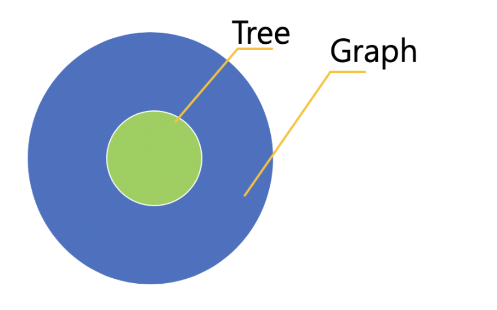

# 그래프와 트리 관계

# 그래프
- 정점과 간선들로 이루어진 집합
- 사이클 o, x
- 방향 o, x
- 노드간 2개이상의 간선 가능
- 노드(vertex)간 부모 - 자식 관계 없다.
  - 루트 노드 존재 x
- 간선(edge)수: 자유

# 트리
- 그래프의 종류중 하나
  - 특수한 그래프
- 사이클 x
- 방향 o
- 노드간 한개의 간선만 가능
- 노드(vertex)간 부모 - 자식 관계 존재
  - 루트 노드 존재 o
- 간선(edge)수: N - 1 (vertex: N개라면)

