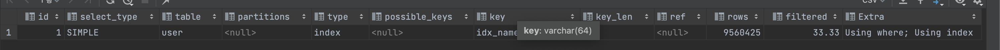
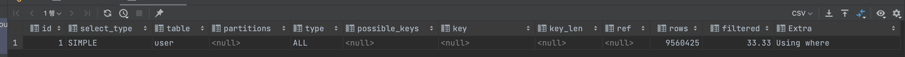

# B-Tree 인덱스를 통한 데이터읽기
- 스토리지 엔진은 어떻게 인덱스를 이용해서 실제 레코드를 읽어낼까? 과정을 알아보자.
  - 인덱스 사용하게할지 사용하지 않게할지 알려면 실제로 인덱스가 어떤방식으로 사용되어 실제 데이터에 access하는지 알아야한다.

## 인덱스 레인지 스캔
- 나머지 방법들보다 '빠른'방법
- 검색해야할 인덱스 범위가 결정됐을 때 사용하는 방식
- 루트 -> 브랜치 -> 리프노드까지 파고들어 검색시작해야할 지점 찾고 **순서대로** 쭉 읽는 방식이다.
  - 오름차순일수도, 내림차순일수도있다. 중요한건 인덱스는 '정렬'이 되어있다.
- 리프노드에서 인덱스를 레인지 스캔(순서대로 쭉 읽기)하여도, 실제 데이터 파일에서 레코드에 접근해 읽어오는 과정이 필요할수도있다.
  - 읽어야할 레코드 개수 마다 랜덤 i/o가 발생한다. 즉, 오래걸리는 작업이다.
  - 해당 작업이 전체 테이블 레코드 개수의 20~25% 이상이면 인덱스 이용하지않고 데이터 파일에서 데이터 읽고 필터링하는게 더 효율적이다.

### 과정
1. 조건을 만족하는 리프노드의 시작지점 위치를 찾는다. : '인덱스 탐색'
2. 1번에서 탐색한 지점에서 순서대로 쭈우욱 읽는다. : '인덱스 스캔'
3. 2에서 읽은 인덱스키와 리프노드의 레코드 주소(innodb라면 pk)를 통해 데이터파일에 access해 레코드를 읽어온다. (비싸고 오래걸리는 작업)

- 커버링 인덱스로 3번 과정을 줄일수있다. 데이터파일에 access하지 않아도 되게끔 만들어 버리는 것이다.

## 인덱스 풀 스캔
- 인덱스를 처음부터 끝까지모두 읽는 방식
  - 인덱스를 제대로 이용하지 못하는 방식임.
- 인덱스 크기가 테이블 크기보다 작아서 테이블 처음부터 끝까지 읽는것(테이블 풀 스캔)보단 효율적이다.
  - 그러나 커버링 인덱스가 아니면 테이블 풀 스캔이 더 빠르다.(인덱스를 통해 데이터파일의 하나의 레코드읽는 작업이 인덱스 통하지 않고 데이터파일의 레코드 하나 읽는 것 보다 3~4배 느림)

- index: (name, grade, age)

- 커버링 인덱스로 인덱스 리프노드에서 데이터 파일로 랜덤 i/o필요 없음
```sql
explain select grade from user where grade < 200;
```


- 커버링 인덱스 사용하지 못해 인덱스 리프노드에서 데이터 파일로 랜덤 i/o필요 함
```sql
explain select * from user where grade < 200;
```


## 루스 인덱스 스캔
- 인덱스 레인지 스캔, 인덱스 풀스캔은 '타이트 인덱스 스캔'으로 모든 범위내의 인덱스나 전체 인덱스를 빼먹지 않고 스캔한다.
- 루스 인덱스스캔은 듬성듬성 인덱스를 읽음
  - 인덱스 스캔중 필요하지 않는 인덱스는 무시함
- group by, min(), max() 최적화 하는 경우 사용함

## 인덱스 스킵 스캔
- 멀티칼럼 인덱스중 첫번째 칼럼을 이용해서 조회하는 쿼리가 아니면 인덱스를 효율적으로 사용할수 없다.
  - 인덱스 풀스캔이나, 테이블 풀스캔..
- mysql 8.0 이상부턴, 인덱스의 첫번째 칼럼을 이용하지 않는 쿼리도 인덱스를 효율적으로 사용할수있게 내부적으로 쿼리를 변경해준다.

- index: (gender, birth_date) (gender 카디널리티: 2, 남/녀)

```sql
explain select gender, birth_date from user where birth_date>='2000-01-01';
```

- 그럼 내부적으로
```sql
-- 1.
select gender, birth_Date from user where gender = '남' and birth_date>='2000-01-01'
-- 2.
select gender, birth_Date from user where gender = '여' and birth_date>='2000-01-01'
```
로 쿼리를 바꾸어 인덱스를 효율적으로 사용하도록 (인덱스 레인지 스캔) 쿼리를 변경해준다.

- 즉 인덱스 스킵스캔은 인덱스의 칼럼을 '스킵'하여도 인덱스를 효율적으로 사용하도록 쿼리를 바꿔준다.
- 다만, 스킵한 한 인덱스의 칼럼의 카디널리티가 너무 크면 오히려 비효율적이라 사용이 안된다.
- 커버링인덱스가 아니면 인덱스 스킵스캔이 사용되지 않는다.
