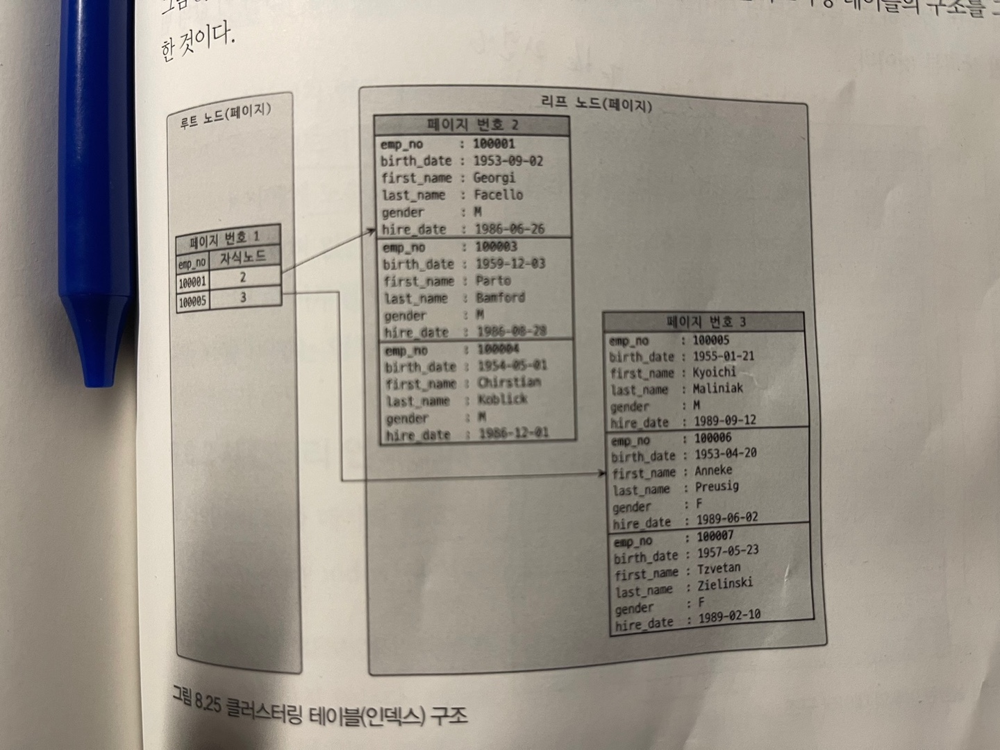
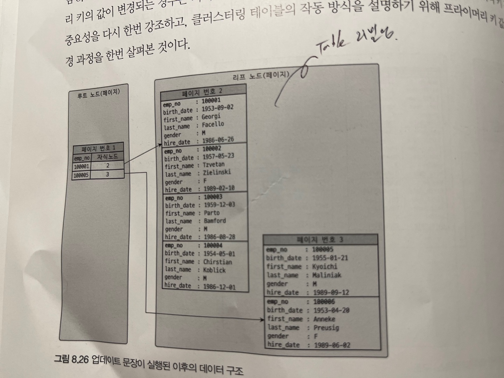

# 클러스터링 인덱스

- 클러스터링 : 군집화(여러개를 하나로 묶는다.)
- Mysql의 클러스터링은 테이블의 레코드를 비슷한 것(프라이머리 키를 기준)들끼리 묶어서 저장하는 형태로 구현됨
  - 비슷한 값을 동시에 조회하는 경우가 많다 (지역성 - locality)
- only Innodb에서만 지원

## 클러스터링 인덱스
- 테이블의 프라이머리 키에 대해서만 적용됨.
- **프라이머리 키 값이 비슷한 레코드들끼리 묶어서 저장하는 것**을 **클러스터링 인덱스**라고 한다.
- 프라이머리 키 값(클러스터링 키)에 의해 **레코드의 저장위치**가 결정된다!!!
  - innodb storage에서 pk는 상당히 중요하다.. pk기준(클러스터링 키 기준)으로 레코드의 저장위치가 결정된다늬...
  - 어떻게 보면 클러스터링 인덱스란 **테이블 레코드의 저장방식**이기도 하다.
- 클러스터링 인덱스로 저장되는 테이블(innodb)는 **프라이머리 키 기반의 검색이 매우 빠르다!!!** (실제로 primary key - 클러스터링 인덱스 기준으로 레코드가 디스크나 메모리에 저장되어있으니)
  - 검색에 특화
- 대신 insert, update, delete가 느리다.
  - 클러스터링 인덱스 기준으로 데이터 레코드들이 실제로 저장되어있기 때문에, 클러스터링 키인 프라이머리 키를 update하면 레코드의 위치가 변경되므로 그만큼 cost존재

## 클러스터링 인덱스(테이블) 구조

- 클러스터링 인덱스도 일반 B-Tree와 구조가 비슷
- 세컨더리 인덱스의 리프노드와 다르게 **클러스터링 인덱스 리프노드엔 레코드의 모든 칼럼이 저장되어 있다.**
  - 세컨더리 인덱스의 리프노드엔 인덱스 키와, **클러스터링 키인 프라이머리키**가 있다. (당연히 innodb기준이다.)
- 만약 프라이머리 키를 업데이트하면?
`update tb_test set emp_no = 100002 where emp_no=100007` (실제로 프라이머리 키는 변경될일이 많이 없지만, 설명을 위해)

- emp_no가 100007인 레코드가 페이지3에서 페이지2로 이동했다.
- 즉, **클러스터링 키인 프라이머리키가 변경되면 클러스터링 인덱스의 구조도 변경된다.**

## 프라이머리 키없는 innodb 테이블은 클러스터링 테이블 어떻게 구성?
- 아래 순서에 따라 구성된다. 
1. 프라이머리키를 클러스터링 키로 선택
2. 프라이머리키가 없으면 'not null' && 'unique index'중 첫번째 인덱스를 클러스터링 키로 선택
   - 이건 몰랐네.. not null이면서 unique한게 primary key와 특징이 동일한 세컨더리 인덱스를 클러스터링 키로 선택하는구나.
3. 자동으로 유니크한 값을 가지도록 증가되는 칼럼을 내부적으로 추가후 클러스터링 키로 선택
   - 내부적으로 추가했으니 개발자가 해당 클러스터링키는 사용할수가 없다...(단점)

## 클러스터링 키가 세컨더리 인덱스에 미치는 영향
- innodb 테이블에서 세컨더리 인덱스가 MyISAM이나 Memory 스토리지 엔진처럼 실제 레코드 주소를 가진다면?
  - 클러스터링 키값 변경(실제로 변경될일 많이 없다.)되면 레코드의 주소가 변경되고, 그때마다 모든 인덱스의 리프노드는 실제 레코드 주소값을 변경해줘야한다. (큰 cost)
  -> 이를 위해 innodb 테이블의 세컨더리 인덱스는 리프노드에 클러스터링 키인 프라이머리 키값이 저장되어있다.

## 클러스터링 인덱스 장/단점

### 장점
- 프라이머리키로 검색할 경우 처리성능이 매우 빠름 (특히 프라이머리 키로 범위검색하는 경우 -> 프라이머리키는 디스크나 메모리상 클러스터링 되어있기에, 순차 i/o가 발생해 빠르다)
- 세컨더리 인덱스가 프라이머리 키를 가지고있으므로 인덱스만으로 처리될수있는 커버링인덱스 활용이 높다.

### 단점
- 세컨더리 인덱스마다 클러스터링 키를 갖기에, 프라이머리 키값이 크면 전체적인 인덱스 크기가 증가
- 세컨더리 인덱스를 통해 검색할때, 클러스터링 테이블을 프라이머리 키로 다시 검색해야하므로 처리 성능 느림 (레코에 직접 접근하는 것보다 인덱스를 통하는게 4 ~ 5배 느림.)
- INSERT할때, 프라이머리 키에 의해 레코드 저장위치 결정되기에 코스트 존재(auto increment면 신경쓸일없다. 그러나 email같은 칼럼을 프라이머리 키로 지정하면 처리성능 느림)
- 프라이머리키 update시, delete하고 insert하기에 처리성능 느리다. (실제로 프라이머리키를 수정할 일이 많이 있을까?)

-> **클러스터링 키는 빠른 읽기의 장점을 얻는 대신, 느린 쓰기의 단점을 얻었다.** (온라인 트랜잭션환경에선 읽기:쓰기의 비율이 9:1정도.)

## 클러스터링 테이블 사용 주의사항

### 클러스터링 인덱스 키의 크기 클때 주의사항
- 세컨더리 인덱스의 모든 인덱스는 클러스터링 키(프라이머리 키)를 가지고 있으므로 프라이머리키를 복합키로 지정하고, 칼럼의 크기가 크면 그만큼 인덱스의 크기도 많이 증가한다.

### 프라이머리 키는 레코드를 대표하는 칼럼
- innodb의 프라이머리 키는 클러스터링 키로, 프라이머리 키를 이용해 검색하면 매우 빠르다. 그러기에 해당 레코드를 대표할만한 칼럼이 프라이머리 키면 좋다.
  - 학생 테이블의 각 레코드는 학생을 대표하는 학번이 어떨까? 어차피, 학생마다 학번은 유일하고, 순차적으로 증가해도 되는 값이닌까 말이다.
  - 물론 그렇지 못하면 auto increment 인조키

### 프라이머리 키는 반드시 명시할것!
- 프라이머리키 없어도, not null인 unique index가 클러스터링 키로 채택되지만 해당 칼럼도 없으면 내부적으로 클러스터링키를 만든다. 그치만 명시적으로 사용할수가 없다는 단점이 있다. 즉, 인조키로 auto_increment를 만드는것과 효과는 동일하지만, 실제로 사용할수가 없으니 차라리 auto_increment인 인조키를 만들어서 사용하자.

### auto-increment 사용 고려 경우
- pk를 복합키로 만들어야하고, 프라이머리키가 큰 테이블에 세컨더리 인덱스도 만들어야하면, auto increment 인조키를 만들자.
  - 세컨더리 인덱스마다 크기가 큰 클러스터링 키를 가지고 있으면 성능에 좋지 못하닌까..

# 소감
- 클러스터링키를 이용해 read transaction이 write transaction 보다 현저히 높은 환경에선 큰 성능 향상을 꾀할수 있다.
- 단순히, 기계적으로 auto increment 인조키를 프라이머리키로 만들어서 사용하기보단, 테이블을 정의할때, 클러스터링 키로 데이터도 군집화가 되고, 클러스터링 키로 검색이 많이 일어날 것이므로, 해당 레코드를 대표할 칼럼을 프라이머리키로 만들어 클러스터링 인덱스를 적용해보는건 어떨까?
- 엄청나게 큰 칼럼을 프라이머리키로 정의하면 innodb에서 세컨더리 인덱스마다 프라이머리 키를 가지고있어 성능에 좋지못하겠구나.. 
- 프라이머리 키를 수정하는 일은 많이 없을듯 한데, 프라이머리 키를 update하면 해당 레코드가 저장되는 페이지가 변경되면서 리빌딩이 일어나는구나.. 굉장히 코스트가 크겠다. 주의하자

