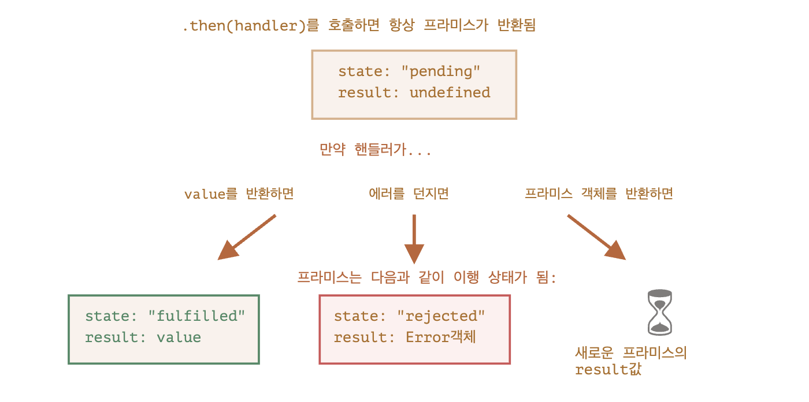

# 프라미스 체이닝

- 저번시간에 비동기적인 작업을 동기적으로 기다리게 하기 위해선 콜백함수 뿐만아니라 Promise 객체를 이용하면 좀더 가독성 높게 목표를 달성할수 있다고 배웠고 Promise 객체의 상태, 소비 메서드등을 배웠다.
- 좀더 깊이 들어가서 첫번째 시간에 고민했던 오래걸리는 여러 스크립트 로드를 Promise를 이용해 순차적으로 처리하려면 어떻게 해야할까?

```javascript
const promise = new Promise((res, rej) => {
    setTimeout(() => {
        return res(1);
    }, 1000);
})

promise
    .then(res => {
        console.log(res) // 1

        return res * 2;
    })
    .then(res => {
        console.log(res) // 2
    })
```

- promise 객체가 생성될때 (생성자 함수 호출될 때) executor함수가 실행되어 1초 딜레이가 있고 그 이후엔 바로 1, 2가 콘솔에 찍힌다.
- result가 `.then` 메서드의 체인(사슬)을 통해 전달된다 해서 **프라미스 체이닝**이라 부른다.
**(프라미스 체이닝은 then 메서드에만 한정된 것이 아니라 catch, finally 메서드 모두 적용된다.)**

이게 가능한 이유는

1. `then` 메서드는 Promise를 반환한다. (그렇기에 .then()에 바로 `then` 메서드를 호출할 수 있다.)
2. 핸들러(then)이 값을 반환하면 핸들러의 반환된 Promise객체의 result가 된다. (return res * 2를 하면 result는 1 * 2인 2가 된다.)

```javascript
const promise = new Promise((res, rej) => {
    setTimeout(() => {
        return res(1);
    }, 1000);
})

promise
    .then(res => {
        console.log(res);

        return res * 2;
    })

promise.then(res => {
    console.log(res)

    return res * 2
})
```
- 위 코드는 콘솔에 1, 1이 찍힌다.
- 하나의 프라미스 객체를 여러번 `then`을 호출한것이기 떄문이다.
- 즉, **프라미스 체이닝**을 이용하지 않았다.

## 프라미스 반환하기
- 하나의 프라미스에서 .then만 여러번 호출해 체이닝을 이용할수도 있지만 .then에서 새로운 프라미스 객체를 반환할수도있다.
- 이 경우는 새롭게 생성한 프라미스 가 처리(settled - fulfilled or rejected)될 때 까지 기다리고 완료되면 그 결과(result)를 다음 .then에서 받는다.

```javascript
const promise = new Promise((res, rej) => {
    setTimeout(() => {
        return res(1);
    }, 1000);
})

promise.then(result => {
    console.log(result); // 1

    return new Promise((res, rej) => {
        setTimeout(() => {
            res(result * 2);
        }, 1000);
    })
}).then(result => {
    console.log(result); // 2

    return new Promise((res, rej) => {
        setTimeout(() => {
            res(result * 2);
        }, 1000)
    })
}).then(result => {
    console.log(result); // 4

    return new Promise((res, rej) => {
        setTimeout(() =>{
            res(result * 2);
        }, 1000)
    })
})
```
- 각 소비 메서드 핸들러(then)은 새로운 프라미스 객체를 반환한다.
- 그래서 프라미스 체이닝이 이루어질 떄마다 1초씩 기다리게된다. (then 하나가 호출될 떄마다 새로운 프라미스 객체가 생성되고, 처리될떄까지 기다린다음 result를 다음 then에게 넘기기 떄문이다.)

## loadScript 프라미스 체이닝을 통해 개선하기

### AS-IS (콜백함수 이용하여 비동기작업을 동기적으로 순차적으로 처리)

```javascript
const loadScript = (script, callback)=> {
    setTimeout(() => {
        console.log(`${script} load success!`)
        callback(); // 여기서 실행해야 비동기적인 작업을 기다린후 실행할수있다.
    }, 2000)
} 


loadScript('/my/script.js', function() {
    loadScript('/my/script2.js', function() {
      loadScript('/my/script3.js', function() {
        // 세 스크립트 로딩이 끝난 후 실행됨
      });
    })
});
```


### TO-BE (프라미스 체이닝 이용하여 비동기작업을 동기적으로 순차적으로 처리)

```javascript
const loadScript = (script)=> {
    return new Promise(function(resolve, reject){
        setTimeout(() => {
            resolve(`${script} load success!`);
        }, 2000)
    })
}


loadScript('/my/script.js')
    .then(result => {
        console.log(result)
        return loadScript('/my/script2.js')
    })
    .then(result => {
        console.log(result)
        return loadScript('/my/script3.js')
    })
    .then(result => {
        console.log(result)
    })
```
(각각의 첫번째, 두번째 then 핸들러는 새로운 프라미스 객체를 반환하지만 마지막 핸들러는 체이닝할 핸들러가 없어 프라미스 객체를 반환하지 않았다)

- 프라미스 체이닝을 통해 비동기적인 작업이 끝나고 어떤 작업이 처리될 지도 한눈에 잘 보이고, 코드도 오른쪽으로 밀리지 않아 가독성도 좋고, 비동기작업 끝나고 할 작업을 미리 정의할 필요 없어 코드 작성에 용이해졌다.

## 결론
- 저번엔 프라미스 객체를 통해 콜백의 단점을 개선했다면 이번엔 비동기적인 작업을 순차적으로 가독성 좋게 처리하기 위한 프라미스 체이닝을 배웠다.
- 구체적으로 핸들러(프라미스 객체 소비 메서드들 - then, catch, finally)는 Promise 객체를 반환하기에 가능한 것이다.
- 새로운 프라미스 객체를 소비메서드 내에서 반환할수도 있는데 이렇게되면 프라미스 생성자가 호출되기에 executor함수가 실행되닌까 해당 프라미스 객체가 fulfilled되고, result가 다음 핸들러에게 전달된다.



