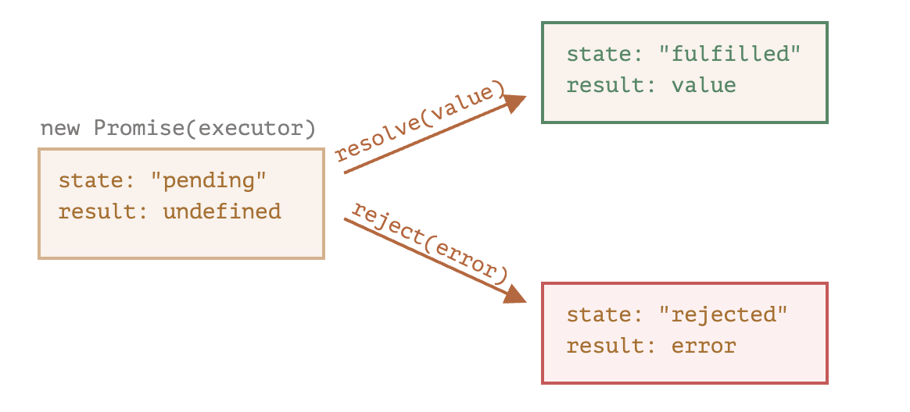

# 프라미스

- 비동기적인 작업을 기다렸다 어떤 구문을 실행하고 싶으면 우린 함수의 인자에 함수를 전달하는 '콜백함수'를 이용했다.
    - 가독성도 좋지않고, 함수간 의존성도 너무 심해져 재사용도 힘든 단점이 있다..
- 자바스크립트에는 이러한 문제를 해결할 Promise 객체가 존재한다.
    - 글에선, 가수가 앨범을 출시하기까지 팬의 신곡 나왔는지 여부의 독촉을 기다리기 힘드니, 구독리스트를 만들어 앨범이 나오면 팬에게 알림이 가도록하는 서비스에 비유하였고 Promise는 구독리스트에 비유하였다. 즉, 얼마나 걸릴지 모르는 곡 제작과 해당 곡제작이 완료되면 알림을 받고 싶은 팬들을 '연결해주는 매개체'가 Promise라고 한다. 정확히 뭔지 알아보자.

```javascript
const promise = new Promise(function (resolve, reject){
    // executor
})
```

- `new Promise` 생성자의 매개변수에 함수를 전달하는데 이 함수를 **executor** 실행함수(실행자)라고 부른다.
- **executor**는 Promise 객체가 만들어짐과 동시에 **자동으로 즉시** 실행된다.
- executor의 매개변수인 resolve와 reject은 자바스크립트가 자체 제공하는 콜백함수로 우린 해당 함수를 신경쓰지 않고 executor안에서 사용하면 된다.
- executor에선 결과를 즉시얻든 늦게얻든 인수로 받은 resolve와 reject 콜백을 **반드시 하나는 호출**하여야 한다.
    - resolve(value): 일이 성공적으로 끝난 경우 결과인 value(resolve 콜백함수의 인자)와 함께 호출
    - reject(error): 에러 발생 시 에러 객체를 나타내는 error(reject 콜백함수의 인자)와 함께 호출

> Promise 객체를 생성함과 동시에 executor함수가 즉시 실행되는데 executor 처리 성공 여부에 따라 성공하면 resolve, 실패하면 reject 콜백함수가 호출된다.

- Promise객체는 두개의 프로퍼티가 존재한다.
    1. state: 'pending'이였다가 resolve되면 'fulfilled', reject되면 'rejected'
    2. result: 처음엔 'undefined'였다가 resolve(value)가 호출되면 'value', reject(error)가 호출되면 'error'로 변환됨

    > 참고로 해당 프로퍼티는 프로미스에서 바로 접근불가능 (좀 이따 이야기할 소비 메서드인 then, catch, finally를 이용해 접근가능!) 못믿겠으면 직접 promise.state 이렇게 찍어봐라.

> 즉, executor 실행함수는 promise객체를 pending상태에서 fulfilled혹은 rejected 상태로 변화시킴



## 예시
```javascript
let fulfilledPromise = new Promise(function(resolve, reject) {
  // 프라미스가 만들어지면 executor 함수는 자동으로 실행됩니다.

  // 1초 뒤에 일이 성공적으로 끝났다는 신호가 전달되면서 fulfilledPromise의 state는 fulfilled가 되고, result는 '완료'가 된다.
  setTimeout(() => resolve("완료"), 1000);
});
```

- fulfilledPromise객체가 만들어짐과 동시에 executor 함수가 실행되고 executor내에서 resolve가 1초 뒤에 호출되고 resolve가 호출되었으므로 fulfilledPromise 객체의 상태는 fulfilled, result는 "완료"가 된다. (참 쉽죠잉?)

```javascript
let rejectedPromise = new Promise(function(resolve, reject) {
  // 프라미스가 만들어지면 executor 함수는 자동으로 실행됩니다.

  // 1초 뒤에 에러가 발생했다는 신호가 전달되면서 rejectedPromise의 state는 rejected가 되고, result는 error 객체가(reference type) 된다.
  setTimeout(() => reject(new Error("에러 발생")), 1000);
});
```

- rejectedPromise객체가 만들어짐과 동시에 executor 함수가 실행되고, executor 함수 내에서 1초 뒤에 reject 콜백함수가 호출되고, reject가 호출되었으므로 rejectedPromise객체의 state는 rejected, result는 Error객체가된다.

> 프라미스는 성공 또는 실패만 한다. fulfilled(성공)이던 rejected(실패)이던 해당 promise 객체는 settled(처리된) promise라고 한다. 반대는 당연히 pending~

- promise생성자의 매개변수인 executor함수는 거의 시간이 오래 걸리는 작업이 들어가지만(비동기 적인 작업) 그렇지 않아도 된다. 동기적으로 바로, 즉시 executor가 실행되어도 해당 프로미스는 settled 프로미스라고한다.

## 소비자: then, catch, finally
- 그렇다면 promise의 결과값은 어떻게 사용(소비)할수 있을까?
- promise객체는 `then`, `catch`, `finally` 메서드를 가지고 있다.
- 해당 메서드를 사용해 등록하여 결과값을 (value나 에러객체)를 사용할수 있다.

### then
- promise의 기본 메서드

```javascript
promise.then(
    function(result){},
    function(error){}
)
```
- 이렇게 첫번째 인자엔 fulfilled된 value, 두번째 인자엔 rejected된 error객체를 `then`메서드를 이용하여 사용할수 있다.
    - then메서드에 두가지 인자가 오는 사실은 이제 알았다. ㅎㅎ 난 항상 fulfilled가 되었을 경우 value를 처리할 때만 사용했었는데..

### catch
- 에러가 발생한 경우만 다루고 싶다면 해당 메서드를 이용
    - `.then(null, function(error){});`와 완벽하게 동일하다.

```javascript
promise.catch(alert);
```

### finally
- 프로미스의 state가 어떻든 실행되는 메서드이다.
- `.then(f, f)`와 동일하다. 어찌됐던 프로미스는 fulfilled 혹은 rejected상태일 것이닌까.

```javascript
promise
    .finally(() => console.log('pass'))
    .then(console.log)
    .catch(alert);
```
- promise state가 fulfilled이던, rejected이던 finally메서드는 value혹은 error객체를 pass한다.

## 프라미스 vs 콜백

### 프라미스
- 오래걸리는 작업이후 `.then`메서드를 이용하기에 흐름이 자연스럽다. 콜백함수는 함수의 흐름을 읽기가 어렵다. (가독성 측면에서 승!)
- 프라미스는 원하는 만큼 `.then`을 호출할수있다.

### 콜백
- 오래걸리는 작업 이후 뭘 할지에 대한 콜백함수를 미리 정의해야함. 또 함수의 실행 흐름이 한눈에 들어오지 않아 가독성 측면에서 별로.
- 콜백은 하나만 가능.

## 정리
- Promise객체가 생성됨과 동시에 생성자 인자인 `executor`함수가 실행된다.
- executor함수는 두가지 인자를 가지고있는데 `resolve`, `reject` 콜백 함수 인자를 가지고있다. 해당 콜백함수는 자바스크립트 내장 함수이다.
- promise객체는 state(상태)와 result(결과값)에 대한 프로퍼티를 가지고 있다.
- promise객체는 `executor`의 실행 결과에 따라 state, result가 정해진다. fulfilled, rejected상태가 되는데 executor 함수 내에서 `resolve(value)`가 호출되면 state는 fulfilled result value, `reject(new Error())`가 호출되면 state는 rejected, result는 error객체가 된다.
- Promise의 결과나 에러를 소비하는 방법은 promise객체의 `then`, `catch`, `finally` 메서드를 이용하는 것이다.
    - promise 상태에 따라 적절한 메서드를 사용하여 promise의 `result`나 `error 객체`를 사용할 수 있다.
- 결국 가장 중요한건 **왜 이 복잡하고도 간단한 promise를 사용하냐**인데, 비동기적인 작업을 동기적으로 기다리는 작업이 콜백함수를 이용하는 것보다 많은 장점을 가지고 있기 때문이다. (가독성, 활용성)


## 결론
- 오랜만에 다시 Promise를 공부했는데 차근차근 다시 공부하니 좋았다. Promise객체는 왜 등장 하였는가부터하여 대충알던 부분과 이런것도있어?라는 부분에 대해 복습하니 좋았다.
- 현업에서 promise 메서드들을 자주 사용하고, 또 `async-await`도 자주사용하는데 기반이 되는 Promise를 다시 공부하는게 매우 의미있었다. 마지막엔 `Promise.all`, `Promise.allSettled`도 공부할것이다. (매우 자주 사용함)