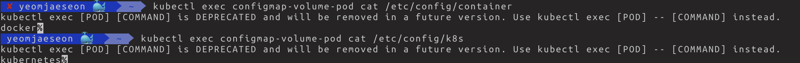

# 7.2.1 컨피그맵

## 컨피그 맵, 시크릿: 설정값을 포드에 전달

- 어플에는 설정 값이 있따. (key=value형식 or nginx.conf처럼 완전한 파일형식)
- 도커 이미지 내부에 정적인 설정 파일을 저장해 놓으면 된다. 그러나 한번 빌드되면 불변의 상태를 가지고 있어 상황에 따라 유연하게 변경 불가
    
    → 포드를 정의하는 “YAML”파일에 환경변수를 직접 놓는 하드코딩 방식을 이용하자!
    

```yaml
apiVersion: apps/v1
kind: Deployment
metadata:
  name: my-nginx-deployment
spec:
  replicas: 3
  selector:
    matchLabels:
      app: my-nginx
  template:
    metadata:
      name: my-nginx-pod
      labels:
        app: my-nginx
    spec:
      containers:
      - name: nginx
        env:
        - name: LOG_LEVEL # 환경변수 집적 기입
          value: INFO # 기입
        image: nginx:1.10
        ports:
        - containerPort: 80
```

→ 개발환경에 따라 다른 설정값을 가진 경우도 존재함. (하드코딩되어있으면 동적으로 설정값을 바꿀 수가 없음, 운영, 개발환경에 따라 설정값이 다르면 두개의 yaml파일을 가지고있어야함)

→ 이걸 도와주는 것이 컨피그맵과 시크릿이라는 오브젝트

- 컨피그맵, 시크릿: YAML파일과 설정값을 분리할 수 있게 도와주는 오브젝트

## 컨피그맵

- 컨피그맵은 일반적인 설정값을 담아 저장할수 있는 쿠버네티스 오브젝트, 네임스페이스에 속하기 때문에 네임스페이스별로 컨피그맵이 존재한다.
- `kubectl create configmap <컨피그맵이름> <각종 설정값들>` 로 쉽게 컨피그 맵 작성가능 (yaml파일로도 컨피그맵 생성가능
- `kubectl create configmap log-level-configmap --from-literal LOG_LEVEL=DEBUG` 처럼 —from-literal 옵션으로 여러개의 key-value 값을 컨피그맵에서 사용하도록 설정가능
- 컨피그맵들 확인 `kubectl get cm`
    
    
    

- 특정 컨피그맵 설정값 자세히 확인
    
    
    
- 컨피그맵을 포드로 가져와 사용하려면 디플로이먼트등의 yaml파일에서 템플릿항목에 해당 컨피그맵 사용한다고 지정하면된다.

## 포드에서 컨피그맵 사용

### 컨피그맵의 데이터를 컨테이너의 환경변수로 가져오기

```yaml
apiVersion: v1
kind: Pod
metadata:
  name: container-env-example
spec:
  containers:
    - name: my-container
      image: busybox
      args: ['tail', '-f', '/dev/null']
      envFrom:
      - configMapRef:
         name: log-level-configmap
      - configMapRef:
         name: start-k8s
```

- `kubectl exec container-env-example env`


- 컨피그맵의 key-value들이 해당 포드의 환경변수로 모두 지정이 되어있다.

### 컨피그맵의 내용을 파일로 포드 내부에 마운트하기

```yaml
apiVersion: v1
kind: Pod
metadata:
  name: configmap-volume-pod
spec:
  containers:
    - name: my-container
      image: busybox
      args: ['tail', '-f', '/dev/null']
      volumeMounts:
      - name: configmap-volume
        mountPath: /etc/config
  
  volumes:
    - name: configmap-volume
      configMap:
        name: start-k8s
```


- 포드에 컨피그맵정보가 마운트 되어있음
- 파일이름: 파일 내용 = 컨피그맵의 key: value 들.
    
    
    

- start-k8s 컨피그맵 정보(참고)
    