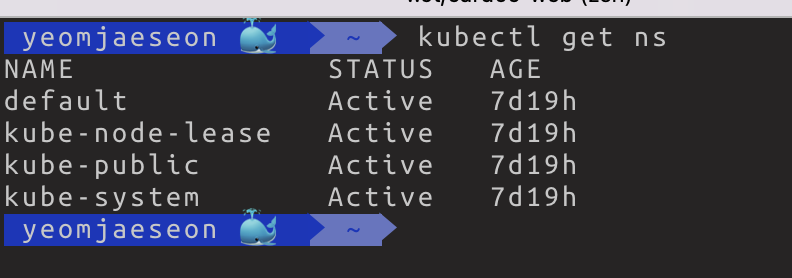
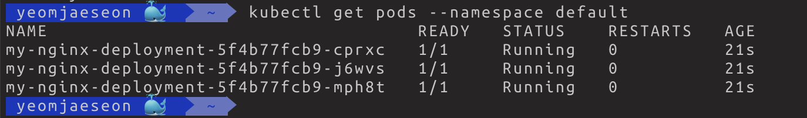
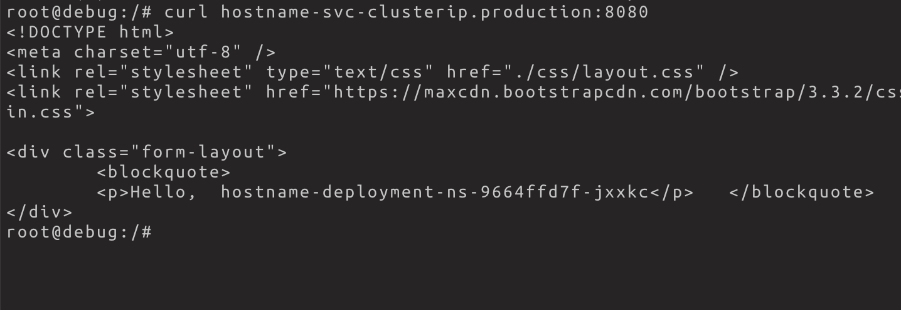

# 7.1 네임스페이스

- 쿠버에는 포드, 레플리카셋, 디플로이먼트, 서비스 오브젝트외에도 굉장히 다양한 오브젝트들이 존재한다
    - `kubectl api -resources`
        
        
        

- 네임스페이스 컨피그맵, 시크릿 등 다양한 오브젝트에 대해서도 알아보자(쿠버 컨테이너 어플리케이션 사용될때 자주 사용되는 개념들임)

## 네임스페이스

- 쿠버에서 리소스들을 논리적으로 구분하기 위해 네임스페이스라는 오브젝트를 제공한다. (일종의 그룹)
- 간단하게 네임스페이스는 포드, 레플리카셋, 디플로이먼트, 서비스 같은 쿠버네티스 리소스들이 묶여있는 하나의 가상공간, 그룹

- `kubectl get namespaces`
    
    
    
- 기본적으로 존재하는 4개의 네임스페이스들

- 특정 네임스페이스의 리소스를 보고 싶으면 `kubectl get pods --namespace default` 처럼 —namespace를 붙인다. (위 명령어는 default 네임스페이스의 포드들 보기)
    
    
    

- `kubectl get pods --namespace kube-system` : 쿠버 클러스터 구성에 필수적인 포드들이존재
- 물론 포드들에 대한 리소스만 네임스페이스로 지정되어있는건 아니고 `kubectl get services --namespace kube-system` 서비스, 레플리카셋, 디플로이먼트에 대한 오브젝트들오 네임스페이스로 지정이 되어있다.
    - → 네임스페이스를 통해 클러스터 내의 가상 클러스터를 만든다!
- 하나의 클러스터 내에서 여러명이 동시에 사용한다면 사용자마다 네임스페이스를 지정할수도있고 용도에 따라 네임스페이스를 지정할수도있다. 보통
    1. 모니터링
    2. 로드밸런싱 인그레스
    
    용도가 대부분이라고한다.
    
- 네임스페이스는 **논리적으로 구분된것일뿐!** 물리적으로 구분된 것이 아니다! (주의)

### 네임스페이스 사용하기

```yaml
# production-namespace.yaml
apiVersion: v1
kind: Namespace
metadata:
  name: production
```

- `kubectl apply -f production-namespace.yaml` 혹은 `kubectl create namespace production` 으로 네임스페이스 생성

- 위 production 네임스페이스에 디플로이먼트와 서비스 생성하기

```yaml
apiVersion: apps/v1
kind: Deployment
metadata:
  name: hostname-deployment-ns
  namespace: production
spec:
  replicas: 3
  selector:
    matchLabels:
      app: webserver
  template:
    metadata:
      name: my-webserver
      labels:
        app: webserver
    spec:
      containers:
      - name: my-webserver
        image: alicek106/rr-test:echo-hostname
        ports:
        - containerPort: 80

---

apiVersion: v1
kind: Service
metadata:
  name: hostname-svc-clusterip
  namespace: production
spec:
  ports:
    - name: web-port
      port: 8080
      targetPort: 80
  selector:
      app: webserver
  type: ClusterIP
```

- production 네임스페이스에 오브젝트들이 잘 만들어졌는지 확인
    
    
    

- `kubectl get pods --all-namespaces` 모든 네임스페이스의 리소스(옆 명령어는 포드들)을 확인
    
    
    

- 클러스터 내부에서 서비스 이름으로 포드에 접근할수 있다고 하였는데 정확힌 ‘같은 네임스페이스 내의 서비스’를 의미함.
    - → <서비스이름>.<네임스페이스이름>으로 다른 네임스페이스의 서비스에 접근가능
    
- default 네임스페이스 포드에서 production 네임스페이스 서비스에 연결
    
    
    
- <서비스이름>.<네임스페이스이름>으로 서비스에 연결
    
    
    

### 네임스페이스에 종속되는 쿠버네티스 오브젝트와 독립적인 오브젝트

- A네임스페이스에 포드를 만들면 A네임스페이스에서만 보이고 B네임스페이스에선 보이지 않는다. 이를 쿠버네티스에선 **오브젝트가 네임스페이스에 속한다**라고 표현한다.
    - 네임스페이스에 속한 오브젝트 보기 `kubectl api-resources --namespaced=true`
        
        
        

- 노드는 쿠버네티스 오브젝트중 하나지만 네임스페이스에 속하지 않는 ‘독립적인 오브젝트'이다. (대표적임)