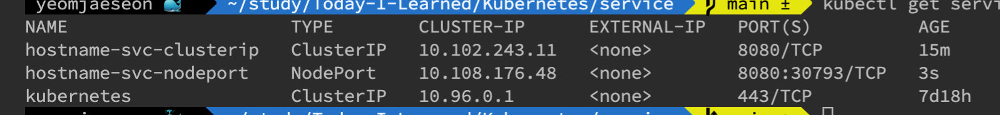

# 서비스(Service): 포드를 연결하고 외부에 노출
- 디플로이먼트로 생성한 포드에 어떻게하면 접근할수있을까?
    - 쿠버 클러스터 내부에서 `kubectl describe`로 얻은 포드의 ip를 이용하면 접근할수있음. 그러나 쿠버 클러스터 외부에선 클러스터의 포드에 어떻게 접근?
- 도커 컨테이너의 ip처럼 포드의 ip는 영속적이지않다. (변한다.) 그래서 ip를 이용해 접근하기보단 **Discovery** (발견)할수있는 방법이 필요
- yaml파일에 정의한 포드의 `containerPort`에 외부에서 접근하려면 **서비스**라고 불리는 별도의 쿠버네티스 오브젝트를 생성해야함. (포드, 레플리카셋, 디플로이먼트도 쿠버네티스의 오브젝트의 일종임)

> 쿠버 어플리케이션 배포를 위해서 반드시 알아야할 개념임, 서비스 없으면 외부 사용자가 우리 쿠버 어플리케이션에 요청할수가없음.

!! 서비스 핵심 기능 세가지
1. 여러개의 포드에 쉽게 접근할수 있도록 고유한 도메인 이름 부여
2. 여러개의 포드에 접근할때, 요청을 분산하는 로드밸런서 기능 수행
3. 클라우드 플랫폼의 로드밸런서, 클러스터 노드의 포트 등을 통해 포드를 외부로 노출

### 서비스는 포드에 어떻게 접근할 것이냐에 따라 종류가 여러개가 존재함.
- ClusterIP 타입: 쿠버 내부에서만 포드들에 접근할 때 사용. 외부로 포드를 노출하지 않기 때문에 쿠버 클러 내부에서만 사용하는 포드에 적합
- NodePort 타입: 포드에 접근할수 있는 포트를 클러스터의 모든 노드에 동일하게 개방. 외부에서 포드에 접근할수 있는 서비스 타입. 포트는 랜덤으로 정해지지만 특정 포트 설정가능
- LoadBalancer 타입: NodePort 타입과 마찬가지로 외부에서 포드에 접근할수 있는 서비스 타입이지만 AWS, GCP와 같은 클라우드 플랫폼 환경에서만 사용가능, 클라우드 플랫폼에서 제공하는 로드 밸런서를 동적으로 프로비저닝해 포드에 연결
    (프로비저닝이란? 필요한 리소스를 기반으로 네트워크에서 사용될 서버를 설정하는 프로세스, 가져다 사용한다고 이해함)

## ClusterIP 타입의 서비스
```yaml
apiVersion: v1
kind: Service
metadata:
  name: hostname-svc-clusterip
spec:
  ports:
    - name: web-port
      port: 8080
      targetPort: 80
  selector:
      app: webserver
  type: ClusterIP
```

- 쿠버 클러 내부에서만 포드에 접근가능.
- `kubectl apply -f hostname-scv-clusterip.yaml` ClusterIp service 생성

- `kubectl get pods`


- 쿠버 클러스터 내에서 ClusterIp 서비스를 이용해 서비스에 연결된 포드에 연결가능


- 서비스와 연결된 여러개의 포드에 자동으로 요청 분산(로드 밸런싱) -> 별도의 설정을 하지 않아도 서비스는 연결된 포드에 대해 로드밸런싱을 수행


## NodePort 타입의 서비스
- 서비스를 이용해 포드를 외부에 노출 (ClusterIp서비스와 다르게 클러스터 외부에서도 접근가능)
- 이름에서 알수 있듯이 모든 노드(Node)의 특정 포트(Port)를 개방해 서비스에 접근하는 방식

```yaml
# hostname-svc-nodeport.yaml
apiVersion: v1
kind: Service
metadata:
  name: hostname-svc-nodeport
spec:
  ports:
    - name: web-port
      port: 8080
      targetPort: 80
  selector:
      app: webserver
  type: NodePort # 여기만 ClusterIp와 다름
```
- `kubectl apply -f hostname-svc-nodeport.yaml`

- 그림의 `8080:30793`의 30793포트는 클러스터의 내부든 외부든 30793포트를 이용하면 동일한 서비스에 접근가능
- NodePort는 ClusterIp의 기능을 포함하고 있어 클러 내부에서 내부 IP와 DNS이름으로 접근가능

- 실제로 NodePort를 많이 사용하진 않는다. SSL인증서와 같은 여러 복잡한 설정을 서비스에 적용하기 어려움. 그래서 NodePort를 이용해 외부로 서비스를 제공하기 보단 **인그레스(ingress)**라고 부르는 쿠버네티스의 오브젝트를 사용.

## LoadBalancer 타입의 서비스
- LoadBalancer 타입의 서비스는 서비스 생성과 동시에 로드 밸런서를 새롭게 생성해 포드와 연결
- NodePort는 각 노드의 IP를 알아야만 포드에 접근할 수 있지만, LoadBalancer타입의 서비스는 클라우드 플랫폼으로부터 도메인 이름과 IP를 할당받기 때문에 NodePort보다 더 쉽게 외부에서 포드에 접근가능


```yaml
# kubectl apply -f hostname-svc-lb.yaml
apiVersion: v1
kind: Service
metadata:
  name: hostname-svc-lb
spec:
  ports:
    - name: web-port
      port: 80
      targetPort: 80
  selector:
      app: webserver
  type: LoadBalancer
```
- `kubectl apply -f hostname-svc-lb.yaml`


- 로드밸런싱 기능 자동으로 사용

## 트래픽의 분배를 결정하는 서비스 속성: externalTrafficPolicy
- A노드이 a포드, B노드에 b포드가있다.
- 요청이 로드밸런싱에 의해 A노드에 갔는데 b포드로 갈수도있다. (a포드가 요청 처리할수 있는 상황임에도)
- 이런 상황에서 불필요한 네트워크 홉이 한단계 더 발생 -> externalTrafficPolicy: Local로 변경하면 해결가능 (포드가 생성된 노드에서만 포드로 접근 가능)
```yaml
apiVersion: v1
kind: Service
metadata:
  name: hostname-svc-lb
spec:
  externalTrafficPolicy: Local
  ports:
    - name: web-port
      port: 80
      targetPort: 80
  selector:
      app: webserver
  type: LoadBalancer
```

## 요청을 외부로 리다이렉트하는 서비스: ExternalName
- 쿠버네티스를 외부 시스템과 연동해야 할 때는, ExternalName타입의 서비스를 사용해야함

```yaml
apiVersion: v1
kind: Service
metadata:
  name: externalname-svc
spec:
  type: ExternalName
  externalName: my.database.com
```
- 클러스터의 포드들이 externalname-svc 서비스로 요청 보내면, my.database.com에 접근가능